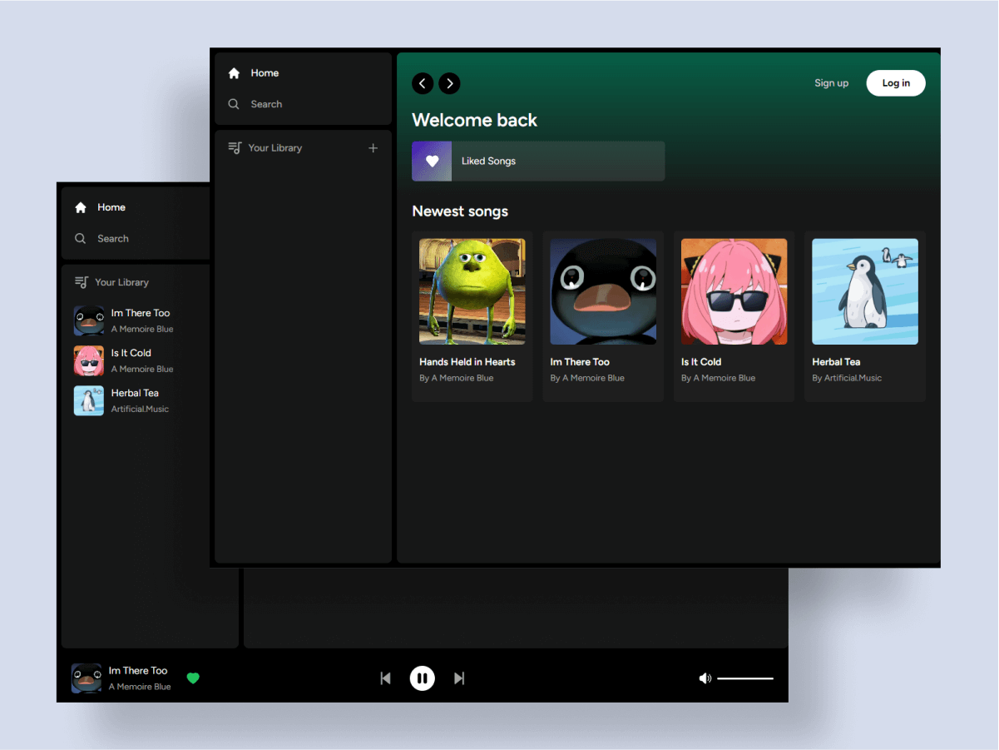

# Spotify Clone

Spotify Clone webapp built with <b>Typescript, Next, Tailwind, & Supabase<b>

## Overview

### Screenshot



### Links

- Repo URL: [Github](https://github.com/gfsxyz/spotify_clone)

- Live Site URL: [Live on Vercel](https://spotify-clone-gfsxyz.vercel.app/)

### Built with

- [Typescript](https://www.typescriptlang.org/) - JS but cooler
- [Next JS](https://nextjs.org/) - JS Framework
- [Tailwind](https://tailwindcss.com/) - For styles
- [Supabase](https://supabase.com/) - Backend

## Author

- Website - [gustifaizal.com](https://gustifaizal.com/)
- Twitter - [@gfsxyz](https://twitter.com/gfsxyz)

## ⚒ Usage

### 👥 Clone the repo

```shell
$ git clone https://github.com/gfsxyz/spotify_clone.git
```

### 📦 Install dependencies

```shell
$ npm install
```

### ✨ Start/Run the app

```shell
$ npm run dev
```
